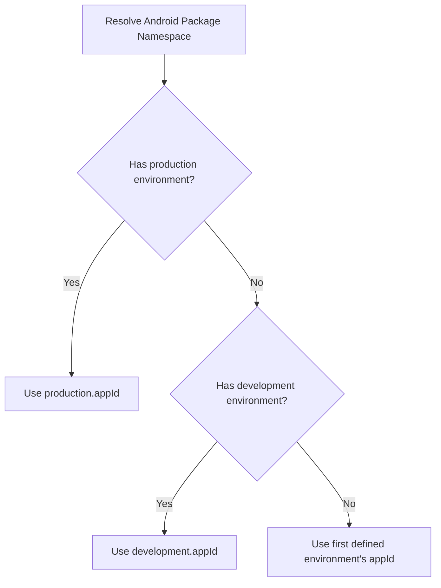
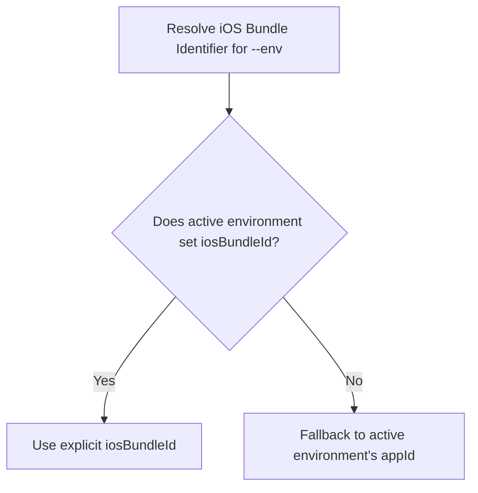

## Overview

`wefter.config.json` is the central configuration file for a Wefter application. It defines your app's native identity, web build output directory (`webDir`), declared native plugins, environment configurations, launcher icons, and splash screen settings.

The Wefter CLI reads `wefter.config.json` to generate native Android and iOS project files, configure native bridge manifests, and inject environment variables.

---

## Configuration File Schema Example

```json
{
  "$schema": "https://wefter.dev/schema/wefter.config.json",
  "appId": "dev.local.demo_app",
  "appName": "Demo App",
  "webDir": "dist",
  "pluginsDir": "node_modules",
  "plugins": ["@wefterjs/camera", "@wefterjs/device"],
  "environments": {
    "development": {
      "appId": "dev.local.demo_app.dev",
      "appName": "Demo App (Dev)"
    },
    "production": {
      "appId": "dev.local.demo_app",
      "appName": "Demo App",
      "iosBundleId": "dev.local.demo_app.ios"
    }
  }
}
```

---

## Runtime Loading & Validation Mechanics

Every CLI command that interacts with a project loads `wefter.config.json` freshly at execution start (`loadWefterConfig(projectDir)`):

1. **Zero State Caching**: Configuration is evaluated on demand during each command invocation. Changes made to `wefter.config.json` take effect immediately on the next command.
2. **Schema Validation**: Configuration structure is strictly validated using Zod schemas. If invalid keys or malformed data types are detected, execution halts immediately:
   ```text
   Invalid wefter.config.json:
     - Property "appId" must match reverse-DNS format (e.g. com.example.app)
   ```
3. **Default Fallbacks**: If `wefter.config.json` contains minimal configuration, default values are assigned automatically (`webDir` defaults to `"dist"`, `pluginsDir` defaults to `"node_modules"`, `plugins` defaults to `[]`).

---

## Android Namespace Derivation Rules

In Android Gradle projects, every Kotlin class and generated R class relies on a root package namespace (e.g., `package com.company.myapp`).

Wefter derives your app's Android package namespace from `wefter.config.json` using the following resolution chain:



<Callout type="important">
  **Canonical Identity Principle**: Android package namespaces require a single
  canonical Java package string. Wefter prioritizes `production.appId` as the
  permanent package identifier so Kotlin plugin imports remain consistent across
  debug and release builds.
</Callout>

---

## iOS Bundle Identifier Resolution Rules

Unlike Android's single package namespace rule, iOS allows distinct bundle identifiers for each build target.

When building or running for iOS (`wefter build ios` / `wefter run ios`), the iOS Bundle Identifier is resolved independently for the active `--env`:



### Resolution Example

Using the configuration sample above:

- **`--env development`**: Resolves `appId` → `dev.local.demo_app.dev` (since `iosBundleId` is unset).
- **`--env production`**: Resolves explicit `iosBundleId` → `dev.local.demo_app.ios`.

---

## Directory & Plugin Settings

### `webDir`

Specifies the relative path to your web framework's compiled build output directory (e.g., `dist`, `build`, `out`). During `wefter sync`, files inside `webDir` are copied directly into `.wefter/native/android/app/src/main/assets/public` and `.wefter/native/ios/public`.

### `pluginsDir`

Specifies the root directory where declared plugins are located (defaults to `"node_modules"`). `wefter sync` reads each plugin listed in `config.plugins` from this folder.

### `plugins`

An array of explicit plugin package names (e.g., `["@wefterjs/camera", "@wefterjs/device"]`). Only plugins listed in this array are woven into native project shells during `wefter sync`. Unlisted packages in `node_modules` are ignored.

---

## Behavior on Ejected Projects

When a project is ejected via [`wefter eject`](/cli/eject), `wefter.config.json` remains the authoritative source for environment definitions, plugin registrations, and app branding. `wefter sync` continues to read `wefter.config.json` to weave native plugin dependencies and update generated registries inside root `android/` and `ios/` directories.
