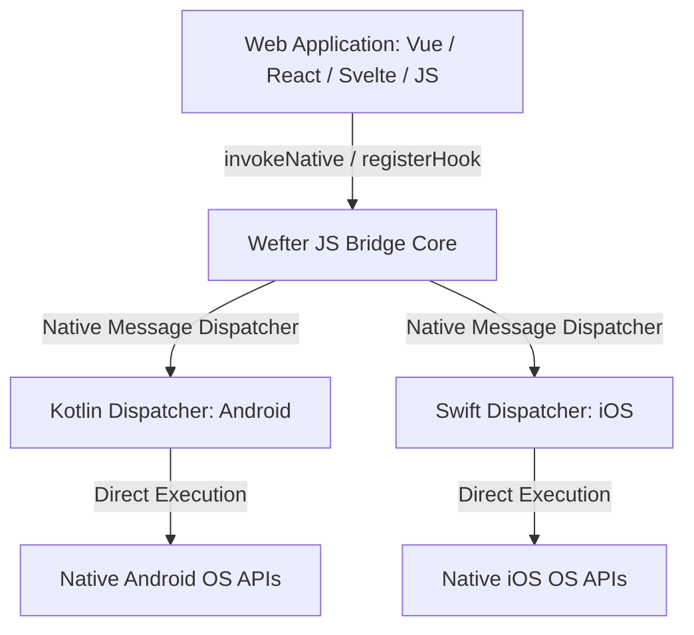

## Overview

**Wefter** wraps your web application inside a lightweight native shell and provides direct, typed access to mobile operating system capabilities (camera, hardware storage, biometrics, sensors, and native dialogs).

Wefter uses a bi-directional bridge between JavaScript and native code (Kotlin on Android, Swift on iOS) with zero runtime interpreters, zero bundled node servers, and zero proprietary rendering engines.

```bash
# Add a native plugin
wefter add @wefterjs/camera

# Run on Android with live hot-reloading
wefter run android --watch

# Run on iOS with live hot-reloading
wefter run ios --watch
```

---

## Core System Architecture



### 1. Web Application Layer

Your frontend UI code is standard web code (HTML, CSS, JavaScript) built with Vue, React, Angular, Svelte, or Vanilla JavaScript. It runs inside a native WebView (`android.webkit.WebView` on Android, `WKWebView` on iOS).

### 2. Wefter JS Runtime (`@wefterjs/core`)

Exposes lightweight, typed client functions (`invokeNative`, `definePlugin`, `registerHook`) to call native methods and listen to native event streams.

### 3. Native Shell & Bridge Engine

During [`wefter sync`](/cli/sync), Wefter generates clean, disposable native shell projects inside `.wefter/native/android` and `.wefter/native/ios`. Annotated native plugin methods (`@WefterMethod` in Kotlin, `// @WefterMethod` in Swift) are invoked directly with **zero reflection overhead**.

---

## Key Framework Features

- **Zero-Interpreter Architecture**: No JS engine (Hermes/V8) bundled into your native binary. The host OS WebView executes web code natively.
- **Framework Agnostic**: Works out-of-the-box with Vite, Next.js, Nuxt, SvelteKit, or plain HTML files.
- **Single JS Codebase, Dual Platform Shells**: Write one frontend application; Wefter compiles target Android APKs and iOS `.app` bundles seamlessly.
- **Explicit Plugin Declarations**: Plugins are declared in `wefter.config.json` and validated before installation (`wefter add`).
- **Disposable Project Generation**: `.wefter/native` is 100% generated from configuration. Eject anytime using [`wefter eject`](/cli/eject).

---

## Getting Started Topics

<Cards>
  <Card
    title="Introduction"
    href="/docs/introduction"
    description="Architecture overview, design philosophy, and core framework capabilities."
  />
  <Card
    title="Environment Setup"
    href="/docs/environment-setup"
    description="Prerequisite installation: Node.js, JDK 17, Android SDK, and iOS Xcode."
  />
  <Card
    title="Installing & Project Initialization"
    href="/docs/installing"
    description="Initializing Wefter in an existing web project using wefter init."
  />
  <Card
    title="App Configuration Reference"
    href="/docs/app-configuration"
    description="Complete field reference for wefter.config.json, environments, and build flags."
  />
</Cards>
