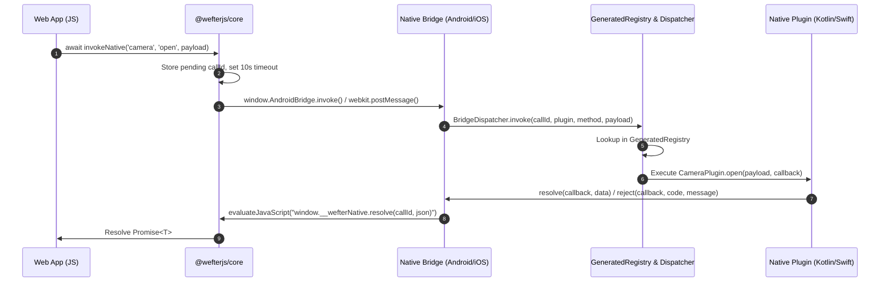
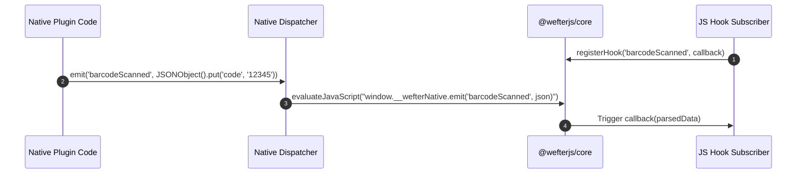

## Overview

The Wefter communication architecture handles three distinct communication paths across the JavaScript-to-Native boundary:

1. **Request / Response Path (`invokeNative`)**: Asynchronous, Promise-based calls from Web JS to native plugin methods.
2. **Push Event Path (`emit` & `registerHook`)**: Unidirectional event streams pushed from native code to Web JS listeners.
3. **Native Lifecycle Path (`@WefterHook`)**: Internal native-to-native signals fired by the host application shell to plugin methods.

---

## 1. Request / Response Path (`invokeNative`)

The diagram below illustrates the exact 7-step lifecycle of an `invokeNative` call:



### Detailed Execution Trace

<Steps>
<Step>

**JS Call Initiation (`@wefterjs/core`)**:
`invokeNative(plugin, method, payload, options)` generates a unique numeric `callId`, stores a pending `{ resolve, reject }` record in `pending` Map, configures an `AbortSignal` listener (if provided), and starts a 10-second timeout timer (configurable via `options.timeoutMs`).

</Step>
<Step>

**Bridge Boundary Crossing**:
The call crosses into native code depending on the host platform:

- **Android**: Calls `window.AndroidBridge.invoke(callId, plugin, method, payloadJson)`, invoking a `@JavascriptInterface` method on `BridgeDispatcher`.
- **iOS**: Calls `window.webkit.messageHandlers.WefterBridge.postMessage({ callId, plugin, method, payload })`, invoking `WKScriptMessageHandler`'s `userContentController(_:didReceive:)`.

</Step>
<Step>

**Plugin Registry Lookup**:
`BridgeDispatcher` looks up `plugin` in its internal registry map. This map is populated during application startup by `GeneratedRegistry.registerAll(dispatcher)` (generated by `wefter sync`).

- _Failure_: If `plugin` is not registered, the call immediately rejects with `WefterBridgeError` code `"UNKNOWN_PLUGIN"`.

</Step>
<Step>

**Dispatcher Routing to `@WefterMethod`**:
The generated dispatch class (`<PluginName>PluginDispatch`) executes a `switch` / `when` statement matching `method`. It invokes the native plugin method:

- **Android**: `plugin.open(payload, callback)`
- **iOS**: `try plugin.open(payload: payload, callback: callback)`
- _Failure_: If `method` is not found, the call rejects with `WefterBridgeError` code `"UNKNOWN_METHOD"`.

</Step>
<Step>

**Native Method Execution & Resolution**:
The native plugin method processes the request and settles the call via inherited helper methods on `WefterPlugin`:

- **Success**: `resolve(callback, data)`
- **Failure**: `reject(callback, code, message)`
- _Unhandled Exception_: If native code throws an unhandled exception without calling `reject()`, the dispatcher catches it and rejects with `WefterBridgeError` code `"PLUGIN_THREW"`.

</Step>
<Step>

**Bridge Return Crossing**:
The native dispatcher evaluates JavaScript in the WebView:

- **Android**: `webView.evaluateJavascript("window.__wefterNative.resolve('0', '{...}')", null)`
- **iOS**: `webView.evaluateJavaScript("window.__wefterNative.resolve('0', '{...}')")`

</Step>
<Step>

**Promise Settlement**:
`window.__wefterNative.resolve` or `reject` is invoked on the web side. `@wefterjs/core` looks up `callId` in the `pending` map, clears the 10-second timeout timer and abort listeners, and settles the original JavaScript `Promise`.

</Step>
</Steps>

---

## 2. Push Event Path (`emit` & `registerHook`)

The push event path allows native plugins to stream real-time data to JavaScript at any time without a preceding `invokeNative` call.



### Event Streaming Mechanics

1. **JS Subscription**: Web code subscribes to event streams using `registerHook`:

   ```ts
   import { registerHook } from "@wefterjs/core";

   const subscription = registerHook("barcodeScanned", (data) => {
     console.log("Scanned code:", data);
   });

   // Unsubscribe when no longer needed
   subscription.remove();
   ```

2. **Native Emission**: Native Kotlin or Swift code calls `emit(hookName, data)` anytime (from location listeners, bluetooth callbacks, hardware timers, etc.):
   ```kotlin
   // Kotlin
   emit("barcodeScanned", JSONObject().put("code", scannedCode))
   ```
   ```swift
   // Swift
   emit("barcodeScanned", data: ["code": scannedCode])
   ```
3. **Delivery**: Native `emit()` executes `window.__wefterNative.emit(hookName, dataJson)`. `@wefterjs/core` deserializes `dataJson` and invokes all registered callback listeners.

<Callout type="info">
  `emit()` operates independently of `callId` or Promises. Native code can call
  `emit()` repeatedly without needing `@WefterHook` annotations.
</Callout>

---

## 3. Native Lifecycle Path (`@WefterHook`)

The `@WefterHook` mechanism allows native plugin methods to subscribe to native-to-native signals dispatched by the host application shell.

### Native Signal Wiring

1. **Annotation**: Plugin methods annotate native methods to receive lifecycle signals:
   - **Kotlin**: `@WefterHook("appReady") fun onAppReady() { ... }`
   - **Swift**: `// @WefterHook("appReady") func onAppReady() { ... }`
2. **Registry Subscription**: During `wefter sync`, `GeneratedRegistry` registers subscriptions with the native dispatcher:
   ```kotlin
   dispatcher.subscribeHook("appReady") { plugin.onAppReady() }
   ```
3. **Dispatch Trigger**: When native application shells call `dispatcher.dispatchHook("appReady")`, all subscribed native plugin methods execute.

### Active Shell Lifecycle Hooks

| Hook Name      | Dispatch Trigger Point                                                                    | Description                                                                |
| -------------- | ----------------------------------------------------------------------------------------- | -------------------------------------------------------------------------- |
| `"appReady"`   | WebView initial page load completion or `invokeNative("__system", "appReady", {})`.       | Fired when the web application completes initial DOM loading.              |
| `"hideSplash"` | `hideSplash()` call from `@wefterjs/core` (`invokeNative("__system", "hideSplash", {})`). | Fired when the web app explicitly requests native splash screen dismissal. |
