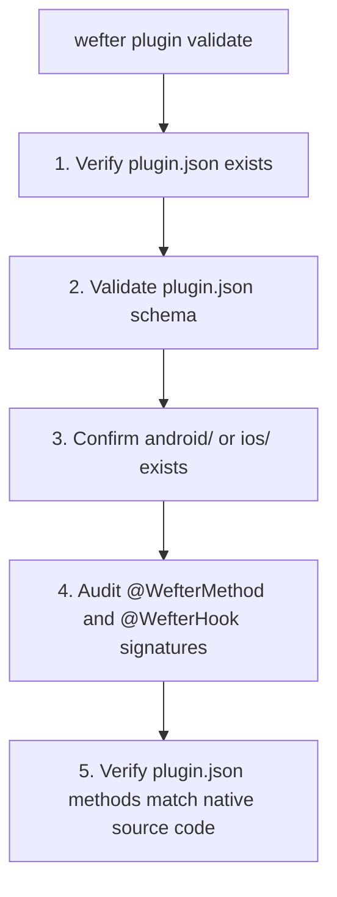

## Overview

Before publishing a Wefter plugin package to npm, validate its schema and native method signatures using [`wefter plugin validate`](/cli/plugin-validate).

`wefter plugin validate`, [`wefter add`](/cli/add), and [`wefter sync`](/cli/sync) all run the exact same underlying validation engine (`validatePluginDirectory` from `@wefterjs/registry-codegen`).

---

## The 5-Step Validation Suite

When `wefter plugin validate` runs against your plugin directory, it enforces five structural rules:



1. **`plugin.json` Presence**: Confirms `plugin.json` exists in plugin root directory.
2. **Schema Verification**: Confirms `plugin.json` conforms to schema properties (`name`, `permissions`, `nativeDependencies`, `methods`, `hooks`, `events`).
3. **Native Directory Check**: Confirms at least one native source directory (`android/` or `ios/`) exists.
4. **Signature Audit**: Audits `@WefterMethod` and `@WefterHook` parameter signatures in Kotlin and Swift files.
5. **Method Agreement**: Confirms methods listed in `plugin.json`'s `methods` array match `@WefterMethod` declarations in native source code.

---

## Validating Standalone

Run standalone validation directly in your plugin repository:

```bash
cd my-wefter-plugin
wefter plugin validate
```

If validation succeeds:

```text
[SUCCESS] Plugin is valid.
```

---

## NPM Publishing Checklist

Once your plugin passes validation, prepare it for publishing to npm:

### 1. Configure `package.json`

Ensure your package exports compiled JS files (`dist/`) and includes `plugin.json`, `android/`, and `ios/` folders in the published package:

```json
{
  "name": "@myorg/scanner-plugin",
  "version": "1.0.0",
  "main": "dist/index.js",
  "types": "dist/index.d.ts",
  "files": ["dist", "plugin.json", "android", "ios", "README.md"],
  "dependencies": {
    "@wefterjs/core": "^0.0.1"
  }
}
```

### 2. Build TypeScript Source

Compile your `src/index.ts` source into `dist/`:

```bash
pnpm build
# or npm run build
```

### 3. Publish to NPM

Publish your scoped plugin package to the npm registry:

```bash
npm publish --access public
```

---

## Consuming the Published Plugin

Once published, application developers can install and declare your plugin using a single command:

```bash
wefter add @myorg/scanner-plugin
wefter sync
```
